<div align="center">
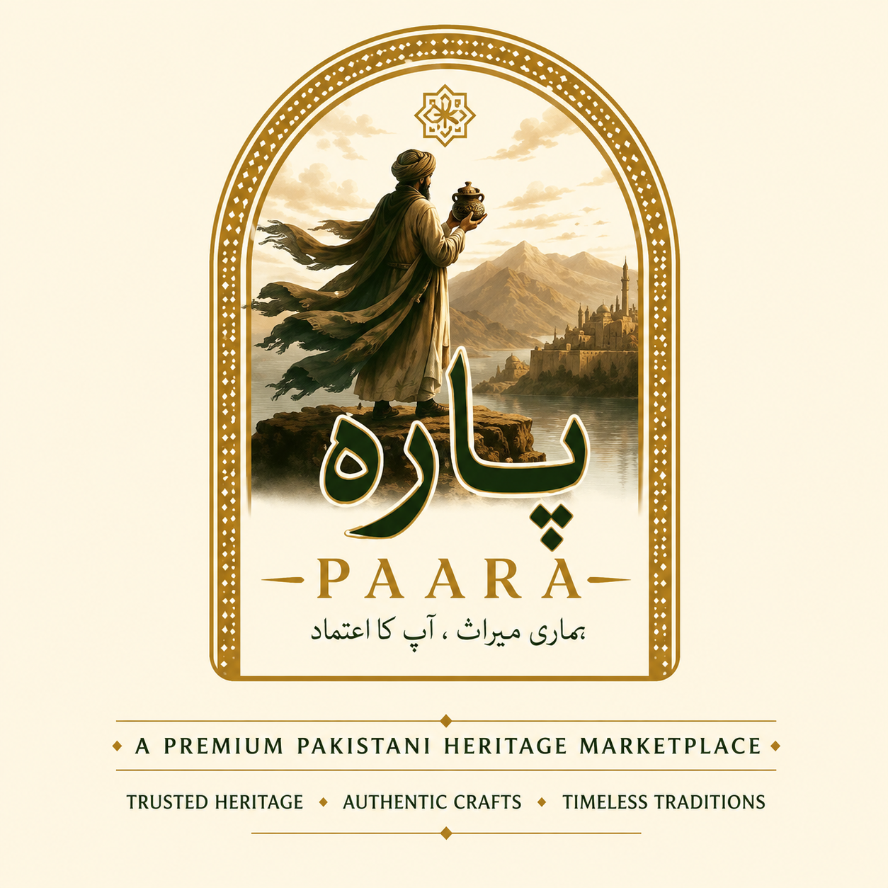
# پارہ · PAARA
### Pakistan's Verified Heritage Crafts Marketplace
*Where regional artisans meet the world — authentic, story-rich, and verified.* 


# پارہ 
· PAARA

### Pakistan's Verified Heritage Crafts Marketplace

*Where regional artisans meet the world — authentic, story-rich, and verified.*

[]()
[](LICENSE)
[]()
[]()
[]()
[]()
[]()
[]()

<a href="#-live-demo">Live Demo</a> ·
<a href="#-key-features">Features</a> ·
<a href="#-architecture">Architecture</a> ·
<a href="#-getting-started">Getting Started</a> ·
<a href="#-roadmap">Roadmap</a>

---

</div>

## 🏛️ Project Overview

**PAARA** (پارہ — Urdu for *"a piece"*) is a full-stack heritage marketplace that connects verified Pakistani artisans with buyers worldwide. Unlike generic e-commerce platforms, PAARA is built around **provenance, cultural identity, and trust** — every seller passes through a four-stage verification pipeline, every product carries a heritage story, and every interaction is designed to celebrate the craft as much as the commerce.

It is, simultaneously, a **production-grade marketplace**, a **cultural archive**, and a **statement that heritage commerce deserves first-class software**.

---

## 🔥 The Problem

Pakistan is home to some of the world's most distinctive handcrafted traditions — Multani blue pottery, Sindhi ajrak, Kashmiri pashmina, Wazirabad Damascus steel, Balochi mirror embroidery, and dozens more. Yet:

- **Authenticity is unverifiable.** Generic marketplaces (Daraz, Amazon, eBay) treat crafts as commodities — no proof the seller is real, no proof the craft is regional, no proof of artisan labor.
- **The story is lost.** Buyers see a product photo and a price. They don't see the kiln in Multan, the 16-stage block-print process in Hyderabad, the six months it takes to weave a pashmina shawl.
- **Artisans get squeezed.** Middlemen capture the margin while the craftsperson — who carries generations of skill — earns the least.
- **Heritage is invisible.** A platform that *should* exist to celebrate regional identity is replaced by yet another bargain-bin grid.

PAARA was built because Pakistani craft deserves better software.

---

## ✨ The Solution

PAARA is a **multi-sided platform** with three first-class roles — **buyers, artisans (sellers), and admins** — wired together by a verification pipeline, a story-rich product model, and an experience that feels closer to a museum than a checkout flow.

| Pillar | What it means in PAARA |
|---|---|
| **Verified Authenticity** | 4-stage seller verification: application → documents → field visit → approval, with heritage badges granted by admins. |
| **Story-First Commerce** | Every product carries city, region, artisan name, materials, craft technique, and an origin narrative — surfaced everywhere. |
| **Bilingual Heritage UI** | English ↔ Urdu toggle, regional greetings on login (جی آیاں نوں / ادب آداب / پاخیر راغلے / خوش آمدید), Urdu calligraphy dividers, regional dance animations on order. |
| **Trust Infrastructure** | Admin moderation, audit log, primary-admin role with 2FA + OTP, role-based access control, notification system. |
| **Buyer Engagement** | Heritage Passport (collect regions through purchases), AI craft assistant, interactive Pakistan heritage map, regional cultural celebration on order, easter eggs. |

---

## 🚀 Live Demo

> **Demo Access:** Local installation only — see [Getting Started](#-getting-started) below to run locally.

Test accounts (seeded automatically):

| Role | Email | Password |
|---|---|---|
| 🟢 **Buyer** | `buyer2@test.local` | `NewStrong123!` |
| 🟢 **Seller (verified)** | `demo.artisans@paara.pk` | `Demo123!` |
| 🟢 **Seller (test)** | `seller1@test.local` | `Test1234!` |
| 🟢 **Admin** | `admin@paara.pk` | `Admin@2026!` |
| 👑 **Primary Admin** | `mafzaala333@gmail.com` | *(set during seeding)* |

> Primary admin login requires 2FA — OTP is printed to the server console in development.

---

## 🌟 Key Features

### 🛒 Buyer Experience

| Feature | Description | Why it matters |
|---|---|---|
| **Story-rich product catalog** | Every listing surfaces city, region, artisan, materials, craft technique, and narrative | Buyers connect with the *maker*, not just the product |
| **Heritage Passport** | Auto-stamps regions as buyers purchase from each province; unlocks "Heritage Explorer" badge at 7/7 | Gamifies cross-regional discovery |
| **Regional welcome on login** | Big-script greeting in the buyer's regional language (Punjabi, Sindhi, Pashto, Balochi, Shina, Kashmiri, Urdu) with matching cultural dance animation | Cultural identity moment, sets PAARA apart instantly |
| **Order celebration overlay** | 10-second animated regional dance overlay (Bhangra, Jhumar, Khattak, Chap, etc.) tied to the dominant region in the order | Memorable, on-brand purchase moment |
| **AI Craft Assistant** | Floating chat widget answers questions about crafts, prices, regions, gift suggestions (Gemini API or curated rule-based fallback) | Conversational discovery, ~300 bilingual Q&A pairs |
| **Heritage Map** | Interactive Pakistan map (Leaflet) with markers for every craft city | Geographic discovery layer |
| **Bilingual UI** | Live EN ↔ اردو toggle across nav, headings, key CTAs | Inclusive for Urdu-first users |
| **Voice search** | Browser SpeechRecognition API, supports Urdu locale | Accessibility + modern UX |
| **Currency switcher** | PKR / USD / GBP / AED / EUR / CAD / AUD / SAR with secondary-price display | Diaspora-friendly |
| **Compare, Recently Viewed, Wishlist** | Standard premium-commerce primitives, all with framer-motion polish | Familiar yet refined |
| **Receipt-style order confirmation** | Vintage thermal-receipt visual with embedded QR code for mobile tracking | Distinctive, brand-aligned |

### 🪡 Seller Experience

| Feature | Description |
|---|---|
| **4-step onboarding wizard** | Shop basics → CNIC documents → workshop photos → bank details, with auto-save and resume |
| **Verification timeline** | Visual 4-stage progress (applied → documents review → field visit → approved) |
| **Premium dashboard** | Recharts-driven revenue line chart, category pie chart, top-product bar chart, recent-orders feed, animated stat counters, 7/30/90-day filters |
| **Custom storefront accent** | Sellers pick an accent color for their public shop page |
| **Product moderation workflow** | Submit → admin approves/rejects → buyer-wide notification on approval |
| **Time capsule** | Optional yearly milestones displayed as a vertical timeline on the public shop |
| **Heritage badges** | Five tiers (Authentic, Master Artisan, Heritage Keeper, Top Rated, Community Favorite) awarded by admins |

### 🛡️ Admin Infrastructure

| Feature | Description |
|---|---|
| **Primary admin model** | Single super-admin role with exclusive rights to create/remove/suspend other admins |
| **Admin request flow** | Any user can request admin access with justification; primary admin approves/rejects |
| **2FA + OTP for admins** | Mandatory two-factor for every admin login; OTP via email/SMS/console fallback |
| **Verification dashboard** | Stage-by-stage seller pipeline with one-click advance/reject + badge management |
| **Platform dashboard** | Real-time stats: users, verified sellers, active products, total orders, GMV |
| **Audit log** | Every admin action logged with actor, target, timestamp, IP, user-agent — filterable |
| **Notification engine** | Role-targeted alerts: new user, new product, moderation outcome, verification stage change, admin request submitted/reviewed |
| **Content moderation** | Product approval, review reporting (3-strike auto-hide), seller response to reviews, buyer story moderation |

### 🎨 Brand & Delight

| Feature | Description |
|---|---|
| **Regional cultural celebration** | Bhangra, Jhumar, Khattak, Chap, Hunza, Kashmiri — SVG dancer variants animated with framer-motion |
| **Urdu calligraphy dividers** | Decorative SVG flourishes between homepage sections |
| **Sticky add-to-cart bar** | Slides up on product detail as user scrolls |
| **Animated number counters** | Dashboard stats tick up from 0 on load |
| **Page transitions** | Subtle fade+slide on every route change |
| **Hidden easter egg** | Type **"PAARA"** anywhere — a truck-art Pakistani truck drives across the screen with floral trail and synthesized horn |
| **Demo product seeder** | 19 authentic Pakistani crafts (Multani Pottery, Sindhi Ajrak, Hunza Walnut Tray, Wazirabad Damascus Knife, Khushab Dhoda, and more) flow through the same dynamic pipeline as real listings |

---

## 📸 Screenshots

> *Screenshots will render once you add them to `docs/screenshots/`.*

<table>
  <tr>
    <td align="center">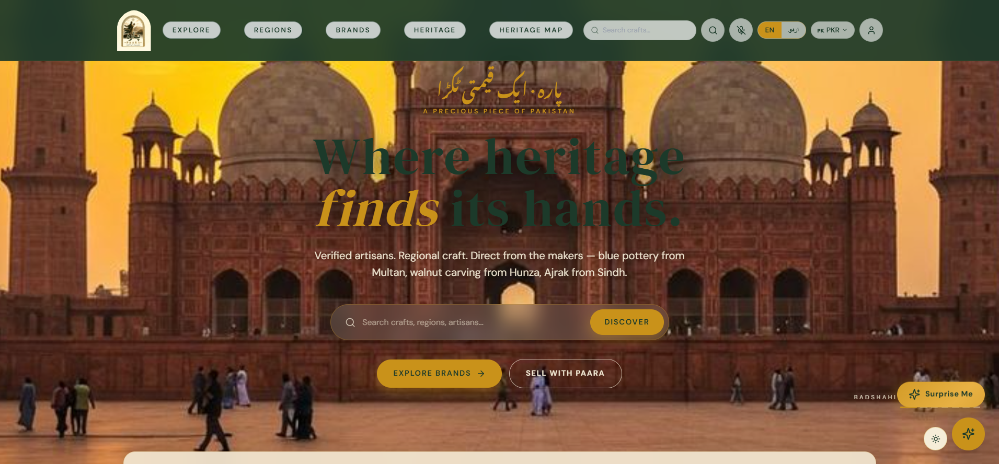<br /><sub><b>Heritage Homepage</b></sub></td>
    <td align="center">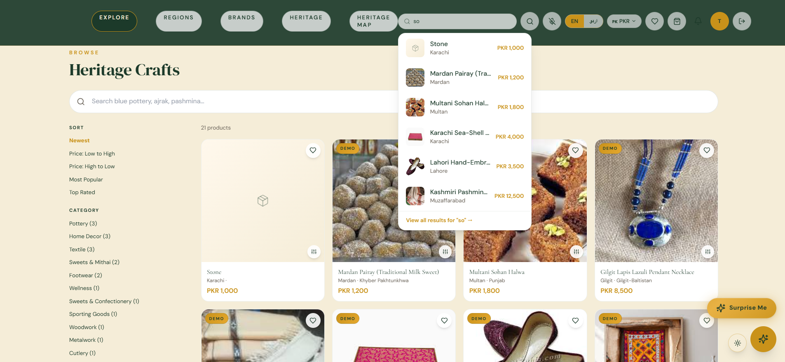<br /><sub><b>Faceted Discovery</b></sub></td>
  </tr>
  <tr>
    <td align="center">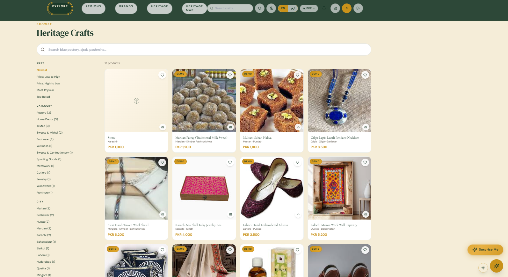<br /><sub><b>Story-Rich Product Page</b></sub></td>
    <td align="center">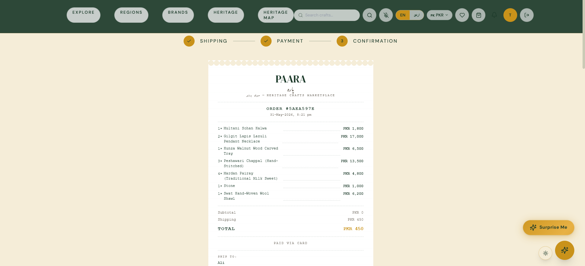<br /><sub><b>Receipt-Style Checkout</b></sub></td>
  </tr>
  <tr>
    <td align="center">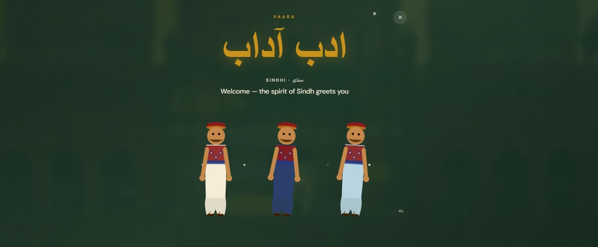<br /><sub><b>Regional Dance Celebration</b></sub></td>
    <td align="center">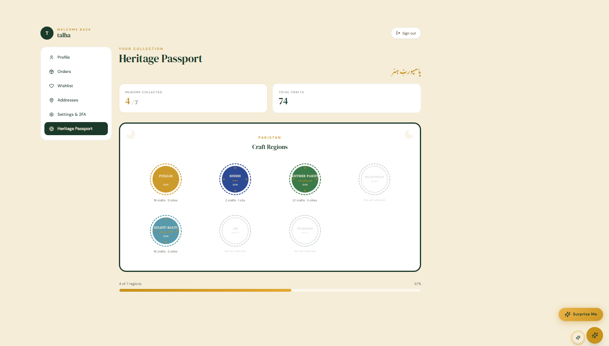<br /><sub><b>Heritage Passport</b></sub></td>
  </tr>
  <tr>
    <td align="center">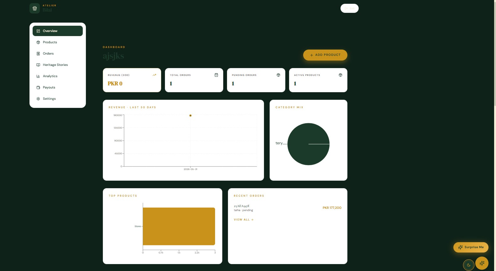<br /><sub><b>Seller Analytics</b></sub></td>
    <td align="center">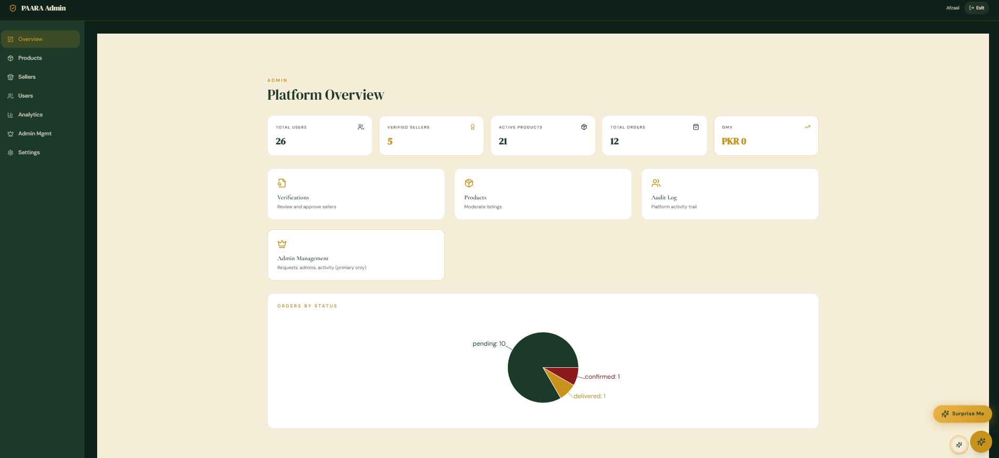<br /><sub><b>Admin Command Center</b></sub></td>
  </tr>
  <tr>
    <td align="center">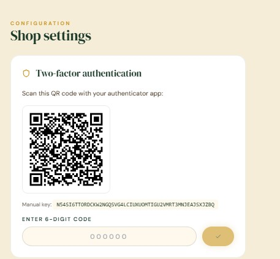<br /><sub><b>4-Stage Verification</b></sub></td>
    <td align="center">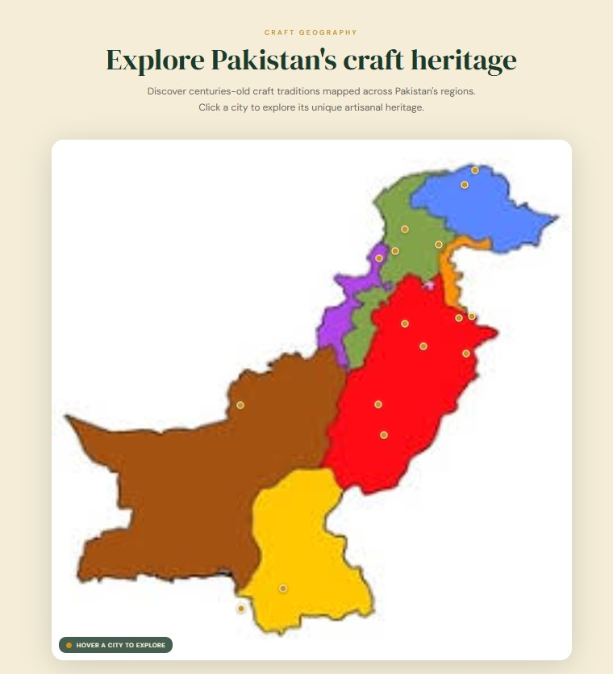<br /><sub><b>Interactive Heritage Map</b></sub></td>
  </tr>
</table>

---

## 🏗️ Architecture

PAARA is a clean three-tier stack with strict separation of concerns: a Vite SPA frontend, an Express REST API backend, and a MongoDB document store. Authentication is JWT-based with a secondary OTP layer for admins.

### High-Level System

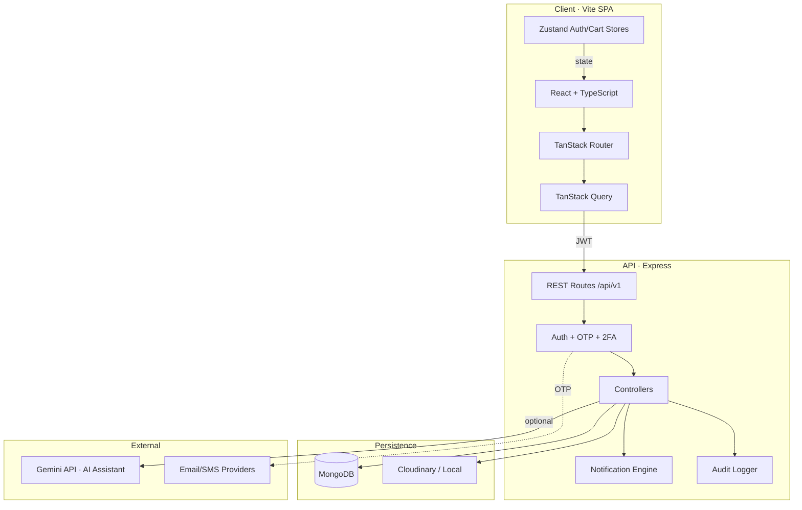

### Domain Model

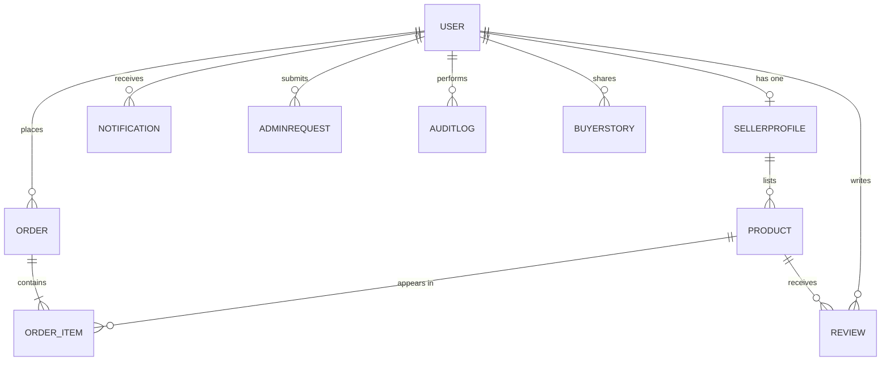

### Request Flow — Admin Login with 2FA

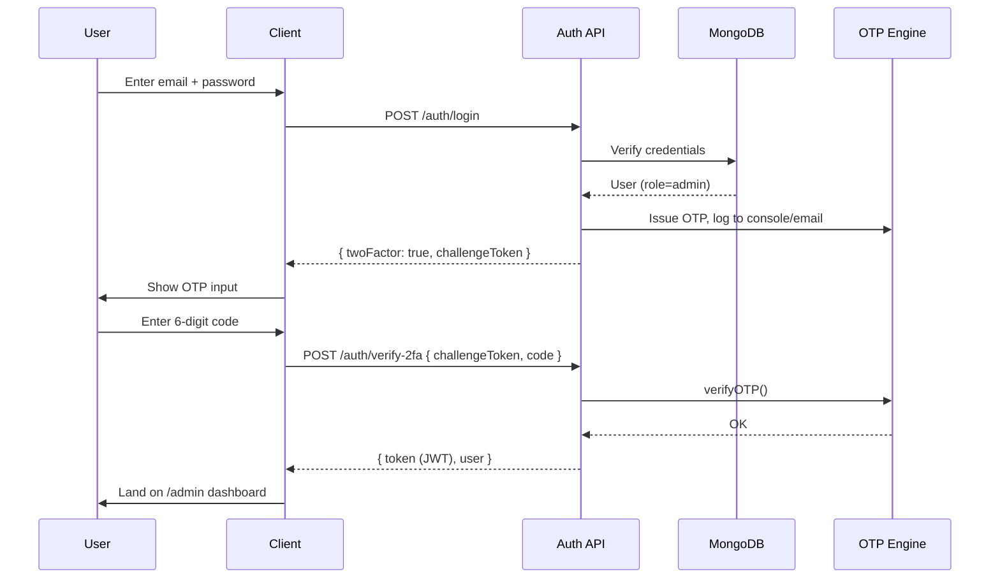

---

## 🧰 Tech Stack

### Frontend
- **Vite** — lightning-fast dev server & build
- **React 18 + TypeScript** — typed component tree, strict mode
- **TanStack Router** — file-based, fully type-safe routing
- **TanStack Query** — server state, caching, invalidation
- **Zustand** — lightweight client state (auth, cart, compare, language)
- **Tailwind CSS + shadcn/ui** — design system with brand tokens (heritage green #1C3A2A, warm gold #C9921A, cream #F5EDD8)
- **Framer Motion** — every animation, page transition, and celebration
- **Recharts** — analytics dashboards
- **React-Leaflet** — interactive Pakistan heritage map
- **Lucide React** — icon system
- **Sonner** — toast notifications

### Backend
- **Node.js 20 + Express** — REST API on `/api/v1`
- **Mongoose** — schema-validated MongoDB modeling
- **bcryptjs + jsonwebtoken** — credential hashing + stateless auth
- **node-cache + compression + helmet** — perf & hardening
- **Cloudinary (optional)** — image uploads
- **Gemini API (optional)** — AI Craft Assistant (with graceful rule-based fallback)
- **nodemon** — dev hot-reload

### Database
- **MongoDB 7** — document store; 12+ collections (Users, SellerProfiles, Products, Orders, Reviews, Notifications, AdminRequests, AuditLogs, OTPVerifications, BuyerStories…)

### Infra
- **Docker + Docker Compose** — single-command spin-up
- **GitHub Actions** — CI build for client + server on every push
- **nginx** — production static serving for the client

### Why these choices

| Decision | Rationale |
|---|---|
| **TanStack over React Router** | File-based routing + type-safe params eliminate a class of bugs; built-in data loaders pair with Query |
| **MongoDB over Postgres** | The data is inherently document-shaped (seller profiles, verification histories, addresses, payment methods, gift metadata) and the verification pipeline + heritage badge arrays would mean many joins in SQL |
| **Zustand over Redux** | The state surface is small; Zustand's API is friction-free and persists trivially |
| **Server-side OTP, console fallback** | Demo-friendly without locking dev behind an email provider; production swaps cleanly to nodemailer/Twilio |
| **Pure SVG + framer-motion celebrations** | No video/audio licensing risk, every dance is code-drawn, ships in kilobytes |

---

## 📁 Folder Structure

```
paara-complete/
├── paara/
│   ├── client/                          # Vite + React + TS frontend
│   │   ├── public/
│   │   │   ├── demo-products/           # 19 seeded craft images
│   │   │   ├── payment-logos/           # JazzCash, EasyPaisa, banks, cards
│   │   │   ├── music/                   # rabab.mp3 (optional ambience)
│   │   │   └── robots.txt
│   │   ├── src/
│   │   │   ├── components/
│   │   │   │   ├── site/                # Nav, Footer, NotificationBell, CraftAssistant
│   │   │   │   ├── celebrations/        # CulturalDancers, RegionalCelebration, RegionalWelcome
│   │   │   │   ├── checkout/            # OrderReceipt, QRTrackingCode, StickyBuyBar
│   │   │   │   ├── easter-eggs/         # TruckArtEgg
│   │   │   │   ├── ui/                  # Skeleton, EmptyState, CountUpNumber, CalligraphyDivider
│   │   │   │   ├── DemoBadge.tsx
│   │   │   │   ├── HeritageMap.tsx
│   │   │   │   ├── MadeInStamp.tsx
│   │   │   │   └── ProductImage.tsx
│   │   │   ├── lib/                     # api.ts, auth-store, cart-store, currency, theme, i18n
│   │   │   ├── hooks/                   # useCountUp, useDebounce
│   │   │   ├── routes/                  # TanStack file-based routes
│   │   │   │   ├── __root.tsx
│   │   │   │   ├── index.tsx
│   │   │   │   ├── products.tsx
│   │   │   │   ├── cart.tsx
│   │   │   │   ├── checkout.tsx
│   │   │   │   ├── account.*.tsx        # orders, passport, wishlist, settings
│   │   │   │   ├── seller.*.tsx         # dashboard, onboarding, verification-status
│   │   │   │   ├── admin.*.tsx          # dashboard, verifications, admins, audit-log
│   │   │   │   ├── shops.$id.tsx
│   │   │   │   └── heritage-map.tsx
│   │   │   └── data/                    # knowledgeBase, heritageQuiz, productCouplets
│   │   ├── Dockerfile
│   │   └── nginx.conf
│   │
│   ├── server/                          # Express + Mongoose backend
│   │   ├── controllers/                 # auth, productController, orderController, sellerProfile, admin
│   │   ├── models/                      # User, SellerProfile, Product, Order, Review, Notification,
│   │   │                                # AdminRequest, AuditLog, OTPVerification, BuyerStory
│   │   ├── routes/                      # /api/v1 mounting
│   │   ├── middleware/                  # authMiddleware, auditLog, cache
│   │   ├── utils/                       # otp, notify, generateProductQA, matchEngine
│   │   ├── data/                        # knowledgeBase.js (curated bilingual Q&A)
│   │   ├── scripts/                     # seedDemoProducts, seedPrimaryAdmin, migrateSellerProfiles
│   │   ├── server.js
│   │   └── Dockerfile
│   │
│   └── docker-compose.yml
│
├── .github/workflows/ci.yml             # CI build on every push
├── docs/                                # architecture diagrams, screenshots
└── README.md
```

---

## ⚙️ Getting Started

### Prerequisites
- **Node.js 20+**
- **MongoDB 7** (local or Atlas)
- **npm** (or pnpm/yarn)
- **Docker + Docker Compose** (optional, for one-command setup)

### Quick start — Docker

```bash
git clone https://github.com/muhafzaala/paara.git
cd paara/paara
cp server/.env.example server/.env       # fill JWT_SECRET at minimum
docker compose up --build
```

- App: <http://localhost>
- API: <http://localhost:5000/api/v1>

### Manual dev

```bash
# Terminal 1 — backend
cd paara/server
npm install
cp .env.example .env
# fill MONGO_URI, JWT_SECRET. (Optional: GEMINI_API_KEY)
npm run dev          # nodemon on :5000

# Terminal 2 — frontend
cd paara/client
npm install
npm run dev          # vite on :5173
```

### Seed demo data

```bash
cd paara/server
node scripts/seedPrimaryAdmin.js          # create primary admin
node scripts/migrateSellerProfiles.js     # backfill seller profiles if upgrading
node scripts/seedDemoProducts.js          # 19 curated Pakistani crafts
```

### Environment variables (server)

```env
MONGO_URI=mongodb://localhost:27017/paara
JWT_SECRET=replace-me-with-a-long-random-string
JWT_EXPIRES_IN=7d
PORT=5000
NODE_ENV=development
CLIENT_URL=http://localhost:5173

# Optional — image uploads
CLOUDINARY_CLOUD_NAME=
CLOUDINARY_API_KEY=
CLOUDINARY_API_SECRET=

# Optional — AI Craft Assistant. Without a key, falls back to rule-based.
GEMINI_API_KEY=
```

---

## 🧭 Usage Guide

### Buyer flow
1. Register → browse `/products` → filter by region/category → open detail
2. Add to cart → checkout (shipping → payment) → place order
3. Watch the regional celebration → see receipt-style confirmation → track at `/account/orders/<id>`
4. Visit `/account/passport` to see stamps for regions you've collected from

### Seller flow
1. Register with `role: "seller"` → auto-redirected to `/seller/onboarding`
2. Complete the 4-step wizard (Shop → Identity → Craft → Payouts)
3. Submit application → admin reviews
4. Once approved → list products → manage orders from `/seller`

### Admin flow
1. Login (2FA OTP) → land on `/admin`
2. Review pending seller verifications in `/admin/verifications`
3. Moderate products at `/admin/products`
4. Inspect platform activity in `/admin/audit-log`
5. **Primary admin only:** manage other admins at `/admin/admins` — approve requests, suspend, remove

---

## 💎 Unique Innovations

- **Heritage Passport** — A buyer's purchase history doubles as a regional collection mechanic; reaching 7/7 unlocks a "Heritage Explorer" status. Gamification rooted in geography, not points.
- **Regional welcome with cultural dance** — On a buyer's first session, an 8-second full-screen welcome shows a greeting in their regional language with a matching SVG dance animation. Built entirely from code-drawn graphics — zero asset weight.
- **Bilingual no-API assistant** — When the AI provider isn't configured, the Craft Assistant degrades to a 300+ entry curated knowledge base with keyword + fuzzy matching, Urdu detection, and live product-data Q&A generation. No silent failure.
- **Receipt-style order confirmation** — A vintage thermal-receipt UI with dashed perforations, monospace details, a QR code for mobile tracking, and a decorative SVG barcode. Distinct, on-brand, memorable.
- **Truck-art easter egg** — Typing "PAARA" anywhere triggers a hand-drawn SVG truck driving across the screen with floral trail and a Web Audio horn — a love-letter to Pakistani street art that costs nothing in payload.
- **Primary-admin model** — Single super-admin with non-revocable rights, separate from a standard admin role. Models real-world platform governance better than a flat admin flag.

---

## 🔐 Security & Hardening

- **Password hashing:** bcrypt with salt rounds 10
- **JWT:** signed, expiry-bound, scoped by role
- **Admin 2FA:** mandatory for every admin login; OTP TTL 5 min, 5 attempts max, 60s resend cooldown, rate-limited
- **Route-scoped middleware:** `protect`, `adminOnly`, `activeAdminOnly`, `primaryAdminOnly`, `require2FA`
- **Helmet + CORS + compression** in production
- **Audit log:** every admin write captured with actor, target, IP, user-agent
- **Schema validation:** Mongoose strict mode; enum constraints on roles, statuses, payment methods
- **No client-side secrets:** AI provider keys live server-side only; frontend never sees them

---

## 🚦 Performance

- **TanStack Query caching** with smart invalidation on mutation
- **node-cache** TTL caching for hot GET routes (`/products/search`, `/recommendations`, `/cities`)
- **Compression** on API responses
- **Lazy media:** product images render through a branded placeholder component that falls back gracefully
- **Database indexes** on every queried field: `Product.status+isActive`, `SellerProfile.user`, `SellerProfile.verificationStatus`, `Notification.user+read+createdAt`, `AuditLog.createdAt`, `OTPVerification.expiresAt` (TTL index)

---

## 🛣️ Roadmap

### Short-term
- [ ] Payment provider integrations (JazzCash + EasyPaisa Sandbox SDKs)
- [ ] Email/SMS OTP via nodemailer + Twilio
- [ ] Cloudinary image pipeline (replace local public/ uploads)
- [ ] Mobile-first refinements on checkout
- [ ] Server-side rendering for shop/product pages (SEO)

### Medium-term
- [ ] PWA support (offline browsing, installable)
- [ ] Shipping rate API (TCS / Leopards / FedEx)
- [ ] Multi-image gallery uploads with auto-WebP conversion
- [ ] Real-time chat between buyer and seller (Socket.io)
- [ ] Inventory low-stock alerts to sellers
- [ ] Wishlist sharing via signed link

### Long-term
- [ ] Mobile apps (React Native, shared TS types)
- [ ] Marketplace-wide subscription model for "Heritage Patron" buyers
- [ ] Real-world artisan verification partners (NGO collaborations)
- [ ] Recommendation engine (collaborative filtering on order history)
- [ ] International shipping rails (USD/GBP/AED first)
- [ ] Embedded artisan livestreams from workshops

---

## 🧗 Challenges & How They Were Solved

| Challenge | Solution |
|---|---|
| **Stale MongoDB indexes** broke seller profile migration mid-run | Built a recovery script that drops all non-`_id_` indexes, lets Mongoose rebuild from current schema, then re-runs the migration |
| **Double-hashed seeder passwords** locked the demo seller out | Eliminated manual `bcrypt.hash` in seeders — relied on the User pre-save hook as the single source of hashing |
| **401s on public routes** after router-wide `protect` middleware | Refactored to per-route middleware; documented the auth surface in the codebase |
| **TanStack child route flicker** on `/account/orders/$id` | Parent component switched to `useMatchRoute` + `<Outlet />` pattern with all hooks above the early return |
| **Browser autoplay restrictions** on the ambience widget | Defaulted to OFF, used `paara_music_*` localStorage with a pulse-invite when user previously enabled it |
| **AI API cost** for the craft assistant | Built a fallback knowledge-base engine that auto-generates 200+ Q&A from live product data, with keyword+fuzzy match and Urdu detection — assistant works with zero external spend |
| **Cultural-music licensing** for regional folk feel | Generated SVG dancer animations entirely in code (Bhangra dhol, Sindhi shawls with shisha mirrors, Khattak sabres, Hunza woolen robes) — no audio/video assets to license |

---

## 🎓 Learning Outcomes

- **Full-stack architecture** — design and ship a 12-collection, role-based, audited system end-to-end
- **TypeScript at scale** — strict type-safety across router, query layer, and props
- **Domain modeling** — multi-stakeholder data model with verification pipelines, audit trails, and notification fan-out
- **Authentication design** — JWT + per-route middleware + OTP-based 2FA + primary-admin role
- **UI/UX systems thinking** — a 7-color brand palette, three typography roles, motion language, and accessibility considerations
- **Defensive scripting** — idempotent migrations, recovery scripts, raw-Mongo bypasses when schemas change mid-flight
- **DevOps fundamentals** — Dockerized stack, GitHub Actions CI, nginx static serving, environment-aware config
- **Product judgment** — cutting features that don't survive the demo bar (e.g. dropping copyrighted folk tracks for code-drawn cultural animations)

---

## 👤 Author

<table>
<tr>
<td>

**Muhammad Afzaal Asghar**

🎓 Bachelor of Science in Financial Technology (FinTech)
🏛️ **National University of Computer and Emerging Sciences (FAST-NUCES), Islamabad**

💼 Developer & Project Creator

🐙 **GitHub:** [github.com/muhafzaala](https://github.com/muhafzaala)
📧 **Email:** mafzaala333@gmail.com

</td>
</tr>
</table>

---

## 🤝 Contributing

Contributions are welcome.

```bash
# 1. Fork & clone
git clone https://github.com/muhafzaala/paara.git

# 2. Create a feature branch
git checkout -b feat/your-feature

# 3. Commit with conventional commits
git commit -m "feat(scope): description"

# 4. Push and open a PR
git push origin feat/your-feature
```

Please:
- Match the existing brand palette and typography
- Keep edits to existing files **additive** unless refactoring is explicitly the goal
- Write commit messages that read like a changelog (`feat(seller): ...`, `fix(auth): ...`)
- Run `npm run build` on both client and server before opening a PR

---

## 📜 License

This project is licensed under the **MIT License** — see [LICENSE](LICENSE) for details.

**Why MIT?** PAARA is intended both as a portfolio piece and a foundation other artisan-focused projects can build on. MIT maximizes reusability with minimal friction — a perfect fit for a cultural-commerce reference implementation.

---

<div align="center">

**Built with care in Pakistan 🇵🇰**

*If this project resonates with you, please ⭐ the repo — it helps more than you'd think.*

</div>


